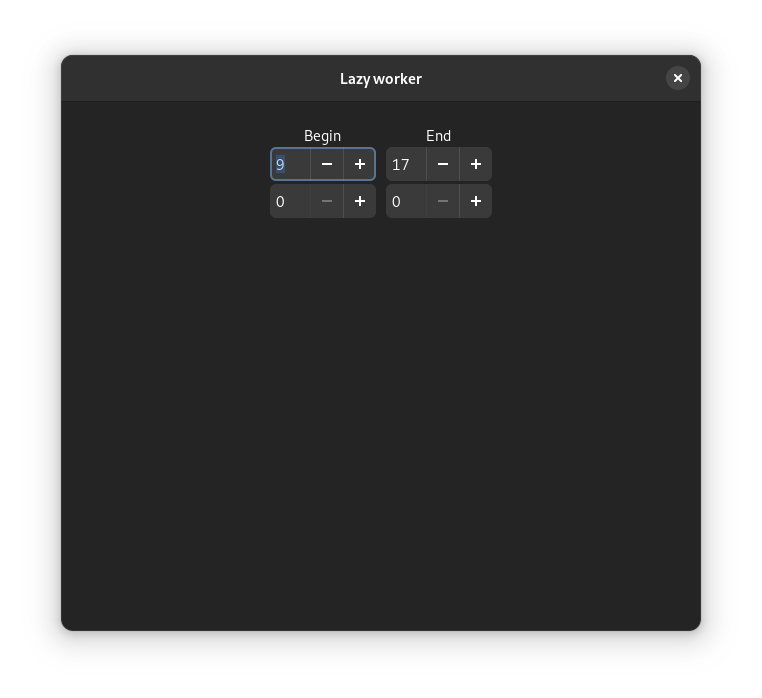

# LazyWorkerExtention
GNOME Shell Extension the display of working day percentages

# Install
Install the deb package from releases or use `make install`.  
Alternatively, download the archive from releases and `tar -xf lazy_worker.tar.gz -C ~/.local/share/gnome-shell/extensions/`  
Re-login to the session and enable the extension

